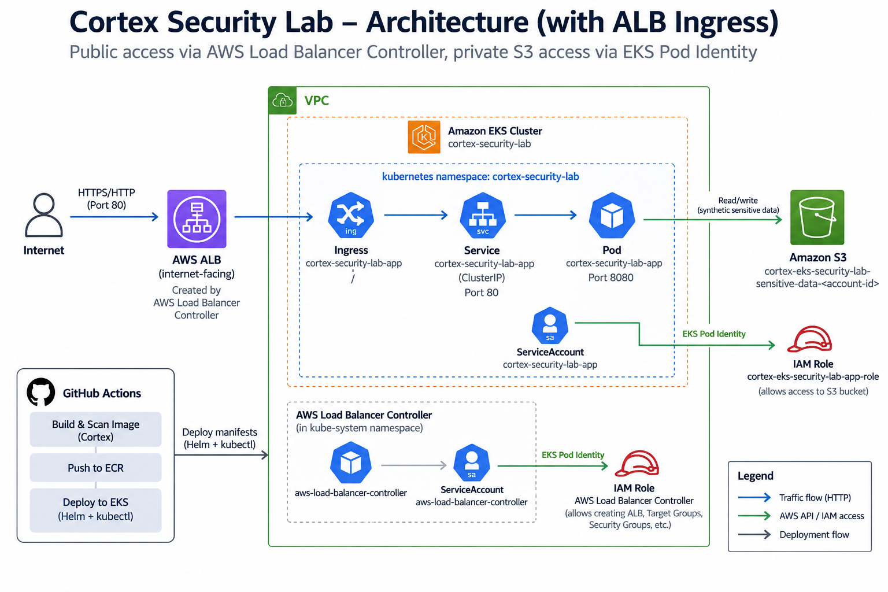

# Cortex EKS Security Lab

A deliberately vulnerable AWS EKS security lab designed to demonstrate how cloud, Kubernetes, workload, identity, application, and data risks can be correlated using Cortex Cloud.

> **Important**
>
> This repository intentionally creates vulnerable resources for security testing and demonstration purposes.
> Deploy it only in an isolated AWS account or controlled lab environment.
> Do not use real credentials, production data, customer data, or production AWS accounts.

---

## 1. Overview

The Cortex EKS Security Lab creates a small but realistic cloud-native environment containing intentionally vulnerable components.

The objective is not simply to generate individual security findings. The lab is designed to demonstrate how multiple security signals can be connected into a broader risk context.

Examples include:

- Internet-exposed Kubernetes workloads
- Vulnerable application dependencies
- Kubernetes security posture issues
- AWS IAM permissions associated with workloads
- EKS Pod Identity
- Sensitive synthetic data stored in Amazon S3
- Secrets intentionally exposed for detection testing
- CI/CD and Infrastructure-as-Code security findings
- Cloud attack paths
- Runtime workload context

The environment can be used to demonstrate Cortex Cloud capabilities across CNAPP, CSPM, KSPM, CWP, CIEM, DSPM, AppSec, and Attack Path analysis.

---

## 2. High-Level Architecture

The diagram below shows how the lab connects the development pipeline, AWS infrastructure, Kubernetes workloads, cloud identities, and synthetic sensitive data into a single security scenario.

  

The primary attack path demonstrated by the lab is:

    Internet
       |
       v
    Internet-Facing AWS ALB
       |
       v
    Kubernetes Ingress
       |
       v
    ClusterIP Service
       |
       v
    Vulnerable Application Pod
       |
       v
    Kubernetes ServiceAccount
       |
       v
    EKS Pod Identity
       |
       v
    AWS IAM Role
       |
       v
    Synthetic Sensitive S3 Bucket

This allows security findings to be correlated across external exposure, workload vulnerabilities, Kubernetes identity, AWS permissions, and sensitive data.

The public application path is implemented using the AWS Load Balancer Controller. The controller is installed in the EKS cluster through Helm and uses EKS Pod Identity to obtain the AWS permissions required to provision and manage the internet-facing Application Load Balancer, target groups, listeners, and security groups.

---

## 3. What the Lab Creates

The Terraform configuration creates the core AWS infrastructure required by the lab.

Major components include:

- Amazon VPC
- Public and private subnets
- Internet Gateway
- NAT Gateway
- Amazon EKS cluster
- EKS managed node group
- Amazon ECR repository
- Amazon S3 bucket containing synthetic sensitive data
- AWS KMS resources
- IAM roles and policies
- EKS Pod Identity
- EKS access entries
- EBS CSI integration
- GitHub Actions deployment role

The Kubernetes layer deploys:

- Vulnerable application container
- Internet-facing AWS ALB managed by the AWS Load Balancer Controller
- Kubernetes Ingress and ClusterIP application service
- Kubernetes ServiceAccount
- MongoDB
- Persistent storage
- Synthetic Kubernetes secrets

---

## 4. Intentionally Vulnerable Application

The application intentionally uses outdated software components to generate vulnerability and application-security findings.

Examples include:

| Component | Version |
|---|---|
| Python base image | 3.9 slim bullseye |
| Flask | 2.0.1 |
| Werkzeug | 2.0.1 |
| requests | 2.25.1 |
| urllib3 | 1.26.5 |
| PyYAML | 5.4.1 |
| pymongo | 3.12.0 |
| Django | 2.2.0 |
| boto3 | 1.40.21 |
| MongoDB | 6.x |

Versions are intentionally outdated.

The public repository does **not** contain malware, EICAR samples, WildFire samples, or real sensitive information.

---

## 5. Security Scenarios

The lab is designed to generate security context across several areas.

### Application Security

The repository contains intentionally vulnerable dependencies that can be evaluated during CI/CD scanning.

### Cloud Security Posture

Terraform creates cloud resources that can be evaluated for configuration and posture risks.

### Kubernetes Security Posture

The EKS environment provides Kubernetes resources that can be evaluated for workload and cluster posture.

### Workload Protection

The application container provides a workload where vulnerabilities and runtime activity can be correlated.

### Cloud Identity and Entitlements

The application receives AWS permissions through:

    Kubernetes ServiceAccount
            |
            v
       EKS Pod Identity
            |
            v
        AWS IAM Role

This allows identity risk to become part of the workload attack path.

### Data Security

The application IAM role can access an S3 bucket containing synthetic sensitive data.

This enables scenarios involving DSPM, data exposure, identity permissions, and attack-path analysis.

---

## 6. Prerequisites

Before deploying the lab, install and configure:

- Git
- GitHub CLI (`gh`)
- AWS CLI
- Terraform
- kubectl

You also need:

- An AWS account dedicated to testing
- Permission to create IAM resources
- Permission to create VPC resources
- Permission to create EKS clusters
- Permission to create S3 buckets
- Permission to create ECR repositories
- Permission to create KMS resources
- Permission to configure a GitHub OIDC provider

The AWS account must also have sufficient service quotas for:

- VPCs
- Elastic IP addresses
- NAT Gateways
- EKS clusters
- EC2 instances

> **Cost warning**
>
> This lab creates AWS resources that generate cost, including EKS, EC2 worker nodes, NAT Gateway, EBS, and other services.
> Destroy the environment when testing is complete.

---

## 7. Fork the Repository

Fork this repository into your GitHub organization or account.

Then clone your fork:

    git clone https://github.com/<YOUR_ORG>/cortex-eks-security-lab.git
    cd cortex-eks-security-lab

The repository uses GitHub's immutable repository identity in the AWS OIDC trust policy.

Retrieve the immutable GitHub identifiers:

    gh api repos/<YOUR_ORG>/cortex-eks-security-lab \
      --jq '{repo_id: .id, repo: .full_name, owner_id: .owner.id}'

Save the returned:

- `owner_id`
- `repo_id`

They will be required during bootstrap.

---

## 8. GitHub OIDC Authentication

The lab uses GitHub Actions OIDC authentication to AWS.

No long-lived AWS access keys are required in GitHub.

The authentication model is:

    GitHub Actions
          |
          | OIDC token
          v
    AWS IAM OIDC Provider
          |
          v
    AWS IAM Role
          |
          v
    Temporary AWS Credentials

The OIDC provider URL is:

    https://token.actions.githubusercontent.com

The expected audience is:

    sts.amazonaws.com

For repositories using GitHub immutable identities, the trust relationship is based on a subject similar to:

    repo:OWNER@OWNER-ID/REPOSITORY@REPOSITORY-ID:ref:refs/heads/main

This prevents a repository with the same name but a different immutable repository identity from automatically inheriting the trust relationship.

### Existing GitHub OIDC Provider

AWS permits only one GitHub OIDC provider for the same provider URL in an account.

Check whether one already exists:

    aws iam list-open-id-connect-providers

If the GitHub provider already exists, provide its ARN to the bootstrap configuration.

If it does not exist, the bootstrap Terraform configuration can create it.

---

## 9. Bootstrap

The `bootstrap/` directory creates the resources required before the main Terraform workflow can operate.

It creates or configures:

- Terraform state S3 bucket
- GitHub Actions Terraform IAM role
- GitHub OIDC trust relationship
- GitHub OIDC provider when necessary

Start with:

    cd bootstrap
    cp bootstrap.tfvars.example bootstrap.tfvars

Edit:

    bootstrap.tfvars

Configure the values for your GitHub organization and repository.

Example structure:

    github_org     = "<YOUR_GITHUB_ORG>"
    github_repo    = "cortex-eks-security-lab"
    github_org_id  = "<YOUR_OWNER_ID>"
    github_repo_id = "<YOUR_REPOSITORY_ID>"

If an AWS GitHub OIDC provider already exists:

    github_oidc_provider_arn = "arn:aws:iam::<ACCOUNT_ID>:oidc-provider/token.actions.githubusercontent.com"

Then run:

    terraform init
    terraform fmt
    terraform validate
    terraform plan

Review the plan before applying.

When ready:

    terraform apply

After bootstrap, Terraform returns outputs including:

- Terraform state bucket
- Terraform GitHub Actions role ARN
- GitHub OIDC provider ARN
- AWS account ID

> `bootstrap/bootstrap.tfvars` is intentionally excluded from Git and must never be committed.

---

## 10. Required GitHub Repository Variables

After bootstrap, configure the following GitHub Repository Variables.

Go to:

**Repository → Settings → Secrets and variables → Actions → Variables**

### AWS_REGION

AWS region where the lab will be deployed.

Example:

    sa-east-1

### AWS_TERRAFORM_ROLE_ARN

IAM role created by the bootstrap process.

Example format:

    arn:aws:iam::<ACCOUNT_ID>:role/cortex-eks-security-lab-terraform-role

GitHub Actions assumes this role using OIDC when executing Terraform.

### TF_STATE_BUCKET

S3 bucket created by bootstrap for Terraform remote state.

Example format:

    cortex-eks-security-lab-tfstate-<ACCOUNT_ID>

### EKS_ADMIN_PRINCIPAL_ARN

AWS IAM principal that should receive administrative access to the EKS cluster.

This will normally be an IAM role or an AWS IAM Identity Center role.

Example format:

    arn:aws:iam::<ACCOUNT_ID>:role/<ADMIN_ROLE>

Use the appropriate administrator principal for your environment.

### LAB_GITHUB_ORG_ID

Immutable numeric GitHub owner ID retrieved using the GitHub API.

Example:

    123456789

### LAB_GITHUB_REPO_ID

Immutable numeric GitHub repository ID retrieved using the GitHub API.

Example:

    987654321

---

## 11. Cortex Cloud Integration

Cortex Cloud integration is optional for the AWS infrastructure deployment but recommended for the complete security demonstration.

The GitHub workflows can execute Cortex CLI scans during the CI/CD process.

Configure the following values.

### Repository Variable: CORTEX_API_URL

Go to:

**Repository → Settings → Secrets and variables → Actions → Variables**

Create:

    CORTEX_API_URL

Set it to the API endpoint associated with your Cortex Cloud tenant.

Example format:

    https://api-<YOUR_REGION_OR_TENANT_ENDPOINT>

Use the API endpoint provided by your Cortex Cloud tenant.

### Repository Secret: CORTEX_API_KEY

Go to:

**Repository → Settings → Secrets and variables → Actions → Secrets**

Create:

    CORTEX_API_KEY

This must contain the Cortex API key used by the CI/CD scanner.

### Repository Secret: CORTEX_API_KEY_ID

Create:

    CORTEX_API_KEY_ID

This contains the corresponding Cortex API Key ID.

### Cortex API Permissions

The Cortex API credentials should be scoped only to the permissions required for the intended CI/CD scanning operations.

Never commit Cortex API credentials to the repository.

Do not place API credentials in:

- Terraform files
- Kubernetes manifests
- Dockerfiles
- shell scripts
- workflow YAML
- application source code

Use GitHub Actions Secrets.

### Optional Scan Behavior

Cortex scanning steps in this lab are designed to be optional.

If Cortex credentials are not configured, the AWS infrastructure can still be evaluated and deployed independently.

The workflow can perform operations such as:

- Code security scanning
- Software composition analysis
- Container image scanning

The exact scan capabilities available depend on the Cortex Cloud tenant configuration and licensing.

---

## 12. Terraform Infrastructure Workflow

The infrastructure workflow is intentionally manual.

It does **not** automatically deploy infrastructure when code is pushed.

Open:

**GitHub → Actions → Terraform Infrastructure → Run workflow**

Two actions are available:

    plan
    apply

### PLAN

Always run `plan` first.

The workflow will:

1. Authenticate to AWS using GitHub OIDC
2. Initialize Terraform
3. Validate Terraform
4. Generate the Terraform plan
5. Display the proposed infrastructure changes

Review the result carefully.

### APPLY

After reviewing the plan, run the workflow again and select:

    apply

The workflow generates a new plan and applies it.

---

## 13. Terraform Outputs

After the infrastructure is created, Terraform provides several important outputs.

These include:

    ecr_repository_url
    eks_cluster_name
    github_deploy_role_arn
    sensitive_s3_bucket_name

The deployment role can be retrieved from an initialized copy of the main Terraform configuration with:

    terraform output -raw github_deploy_role_arn

The main Terraform backend must be initialized against the same remote state used by the infrastructure workflow before running this command locally.

Alternatively, retrieve the deployment role ARN from the Terraform workflow output or AWS IAM console.

---

## 14. AWS_DEPLOY_ROLE_ARN

After the infrastructure has been successfully created, configure one additional GitHub Repository Variable:

    AWS_DEPLOY_ROLE_ARN

Its value is the Terraform output:

    github_deploy_role_arn

Example format:

    arn:aws:iam::<ACCOUNT_ID>:role/cortex-eks-security-lab-deploy-role

This role is assumed directly by GitHub Actions using OIDC.

It provides the permissions required for application deployment operations such as:

- Amazon ECR
- Amazon EKS
- Kubernetes deployment operations

The resulting authentication flow is:

    GitHub OIDC
       |
       +--> AWS_TERRAFORM_ROLE_ARN
       |       |
       |       +--> Terraform / remote state
       |
       +--> AWS_DEPLOY_ROLE_ARN
               |
               +--> ECR / EKS deployment

---

## 15. Application Deployment Workflow

Application deployment is also intentionally manual.

Open:

**GitHub → Actions → Application Build and Deploy → Run workflow**

The workflow performs the following operations:

1. Authenticates to AWS using the Terraform OIDC role
2. Reads Terraform outputs from remote state
3. Discovers the EKS cluster
4. Discovers the ECR repository
5. Discovers the synthetic sensitive-data S3 bucket
6. Assumes the application deployment role using GitHub OIDC
7. Builds the vulnerable container image
8. Optionally executes Cortex scans
9. Pushes the image to Amazon ECR
10. Configures access to the EKS cluster
11. Renders runtime Kubernetes configuration
12. Deploys MongoDB
13. Deploys the vulnerable application
14. Exposes the application through an internet-facing AWS ALB, Kubernetes Ingress, and ClusterIP service

No AWS account ID, EKS cluster name, ECR repository URL, or S3 bucket name needs to be hardcoded into the public repository.

---

## 16. Dynamic S3 Bucket Injection

The S3 bucket name is dynamically retrieved from Terraform state.

The Kubernetes manifest contains the placeholder:

    __S3_BUCKET__

During deployment, GitHub Actions replaces this placeholder in the runner workspace with the actual bucket name.

The resulting environment variable inside the application is:

    S3_BUCKET=<generated-bucket-name>

The public Git repository therefore remains portable between AWS accounts.

---

## 17. Synthetic Sensitive Data

The lab intentionally creates synthetic data for security testing.

No real customer or production information should be stored in the lab.

Synthetic examples can include:

- Fake customer records
- Fake account identifiers
- Fake email addresses
- Synthetic financial patterns
- Test data classification markers

These objects exist only to provide data-security context for DSPM and attack-path demonstrations.

---

## 18. Synthetic Credentials

The Kubernetes configuration may contain intentionally exposed **dummy credentials**.

These values exist only to generate secrets-detection and posture findings.

They must never correspond to:

- Real AWS credentials
- Real database passwords
- Real Cortex API keys
- Real corporate credentials
- Production systems

---

## 19. Example Attack Path

One of the primary scenarios created by the lab is:

    Internet
       |
       v
    Internet-Facing AWS ALB
       |
       v
    Kubernetes Ingress
       |
       v
    ClusterIP Service
       |
       v
    Vulnerable Application
       |
       v
    Kubernetes ServiceAccount
       |
       v
    EKS Pod Identity
       |
       v
    AWS IAM Role
       |
       v
    S3 Bucket
       |
       v
    Synthetic Sensitive Data

Rather than evaluating each finding independently, a CNAPP platform can use these relationships to provide broader risk context and prioritization.

---

## 20. Cortex Cloud Security Context

Depending on the Cortex Cloud modules enabled in the tenant, the environment can be used to demonstrate areas such as:

| Area | Example Context |
|---|---|
| AppSec | Vulnerable dependencies and IaC |
| CSPM | AWS configuration posture |
| KSPM | Kubernetes configuration posture |
| CWP | Container and workload vulnerabilities |
| CIEM | IAM permissions and workload identities |
| DSPM | Sensitive data discovery and exposure |
| Attack Paths | Internet → ALB → Ingress → workload → identity → data |
| Runtime | Workload activity and runtime telemetry |

Actual findings depend on tenant configuration, enabled capabilities, licenses, scanning status, and deployed resources.

---

## 21. Repository Security Model

This repository intentionally separates infrastructure authentication from application deployment.

The Terraform role is used for infrastructure operations.

The application deployment role is used for ECR and EKS deployment.

Both use GitHub OIDC.

Static AWS credentials should **not** be stored in GitHub.

Do not configure:

    AWS_ACCESS_KEY_ID
    AWS_SECRET_ACCESS_KEY

for the GitHub workflows used by this lab.

---

## 22. Portability

The repository is designed to be forkable.

Customer-specific values are provided through:

- Terraform variables
- GitHub Repository Variables
- GitHub Actions Secrets
- Terraform outputs
- Runtime manifest rendering

Values that should never be hardcoded include:

- AWS account ID
- GitHub owner ID
- GitHub repository ID
- EKS cluster name
- ECR repository URL
- S3 bucket name
- Cortex API credentials

---

## 23. Troubleshooting

### GitHub cannot assume the Terraform role

Verify:

- GitHub owner name
- GitHub repository name
- Immutable owner ID
- Immutable repository ID
- Branch name
- OIDC provider ARN
- OIDC audience

The trust policy is intentionally restrictive.

### OIDC provider already exists

Do not attempt to create a second GitHub provider.

Pass the existing provider ARN to:

    github_oidc_provider_arn

### Terraform cannot create a VPC

Check the AWS VPC quota for the selected region.

### EKS deployment cannot authenticate

Verify:

- `AWS_DEPLOY_ROLE_ARN`
- EKS access entry
- GitHub OIDC trust relationship
- repository immutable IDs

### Application cannot access S3

Verify:

- EKS Pod Identity association
- Kubernetes ServiceAccount
- IAM role
- IAM S3 permissions
- `S3_BUCKET` environment variable

### Cortex scan does not run

Verify:

- `CORTEX_API_URL`
- `CORTEX_API_KEY`
- `CORTEX_API_KEY_ID`
- Cortex API permissions
- Cortex tenant licensing

---

## 24. Cleanup

The lab creates billable AWS resources.

Before destroying the underlying AWS infrastructure, remove Kubernetes resources that may create AWS-managed resources such as Load Balancers.

For example, after configuring `kubectl` for the lab cluster:

    kubectl delete -f kubernetes/app.yaml --ignore-not-found
    kubectl delete -f kubernetes/mongodb.yaml --ignore-not-found
    kubectl delete -f kubernetes/serviceaccount.yaml --ignore-not-found

Confirm that Kubernetes-created Load Balancers have been removed before destroying the VPC.

Then initialize the main Terraform configuration against the same remote backend and review a destroy plan:

    terraform plan -destroy

Only after reviewing the destroy plan should the environment be destroyed:

    terraform destroy

Finally, remove bootstrap resources only when the main environment no longer depends on them.

> Always review destroy operations before execution.

---

## 25. Required GitHub Configuration Summary

### Repository Variables Before Infrastructure Deployment

    AWS_REGION
    AWS_TERRAFORM_ROLE_ARN
    TF_STATE_BUCKET
    EKS_ADMIN_PRINCIPAL_ARN
    LAB_GITHUB_ORG_ID
    LAB_GITHUB_REPO_ID

### Repository Variable After Infrastructure Deployment

    AWS_DEPLOY_ROLE_ARN

### Optional Cortex Cloud Repository Variable

    CORTEX_API_URL

### Optional Cortex Cloud Repository Secrets

    CORTEX_API_KEY
    CORTEX_API_KEY_ID

---

## 26. Recommended Deployment Sequence

    1. Fork repository
    2. Retrieve GitHub immutable owner and repository IDs
    3. Check for an existing AWS GitHub OIDC provider
    4. Configure bootstrap/bootstrap.tfvars
    5. Run bootstrap Terraform
    6. Configure required GitHub Repository Variables
    7. Configure Cortex Cloud Variables and Secrets if desired
    8. Run Terraform Infrastructure with PLAN
    9. Review the Terraform plan
    10. Run Terraform Infrastructure with APPLY
    11. Retrieve github_deploy_role_arn
    12. Configure AWS_DEPLOY_ROLE_ARN
    13. Run Application Build and Deploy
    14. Integrate the AWS account and EKS environment with Cortex Cloud as required
    15. Validate findings, relationships, and attack paths
    16. Remove the lab when testing is complete

---

## 27. Disclaimer

This project is intentionally insecure.

It exists exclusively for:

- Security demonstrations
- Product evaluation
- Training
- Research
- Controlled proof-of-concept environments

Do not deploy this repository into a production AWS account.

Do not use real credentials.

Do not use real sensitive data.

Do not expose systems that are not explicitly dedicated to this lab.

---

## Cortex EKS Security Lab

**Build insecure on purpose. Understand risk in context.**
